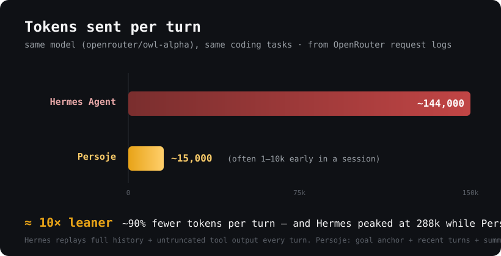

# Persoje

A token-efficient agentic coding CLI for [OpenRouter](https://openrouter.ai). Point it at *any* model — a free stealth preview, a small open model, or a frontier one — and a lean harness keeps it honest and keeps your context small.

The premise: **a good harness makes a cheap model punch above its weight.** Heavier agents replay the whole conversation plus untruncated tool output and let context balloon before compacting. Persoje keeps a lean working set, so the same model runs at a fraction of the tokens per turn.



> Same model, same coding tasks, from OpenRouter request logs against a conventional full-replay agent. Both auto-compact — but the conventional agent lets context grow to ~280k first (median ~143k/turn); Persoje keeps a bounded working set and runs ~12× leaner.
>
> For a **reproducible, apples-to-apples** number, [`bench/`](bench/) runs the *same* harness and model with Persoje's token discipline on vs off. Honest result: on tiny tasks it's a wash, but on work with large tool output it's **~2.4× leaner per turn with a 69% smaller peak**, and the gap widens with session length. The discipline earns its keep on real debugging, not three-turn toys.
>
> Lean is only half the story — [`evals/`](evals/) checks the agent actually *finishes* the task (run → fix → verify, add a feature + test, rename across a file, explain code, look something up on the web), scoring completion deterministically (command exits 0) or via an LLM judge, with tokens/turn reported alongside.

```
❯ fix the failing test in calc.py

◇ read(calc.py)        ⎿ 13 lines · 3ms
✎ edit(calc.py)        ⎿ 1 replacement
▸ bash(python3 calc.py) ⎿ all tests pass · 27ms

╭─ ✦ persoje ──────────────────────────────────────────╮
  Fixed — average() divided by len+1 instead of len.
╰────────────────────────────────────────────────────────╯
 ⬡ owl-alpha │ 1.3K/1M [░░░░░░░░░░] 0% │ $0.00 │ ⏱ 4s
```

▶ **Demo:** [`docs/demo.cast`](docs/demo.cast) — a real recorded session (`asciinema play docs/demo.cast`). The run above is verbatim from it: read → run → diagnose → fix → verify, ~5 calls, $0.

## Install

One command (needs [Bun](https://bun.sh)):

```bash
curl -fsSL https://raw.githubusercontent.com/acunningham-ship-it/Persoje/main/install.sh | bash
```

Rather read it first? Clone and run the same script — it clones/updates, builds a standalone binary, and symlinks `persoje` onto your PATH (re-run any time to update):

```bash
git clone https://github.com/acunningham-ship-it/Persoje.git && cd Persoje && ./install.sh
```

Then run `persoje` — first launch sets up your `OPENROUTER_API_KEY` and model. [ripgrep](https://github.com/BurntSushi/ripgrep) is used by the grep tool if present.

First launch with no config opens a setup wizard: validates your key, lists free tool-capable models, and writes `~/.config/persoje/config.json`.

## Usage

```bash
persoje                       # interactive TUI (default)
persoje "fix the build"       # one-shot, prints token + cost totals
persoje --plain               # bare REPL, no TUI
persoje --resume <id>         # resume a session by id
persoje --model openrouter/owl-alpha
persoje dream                 # offline: consolidate sessions into memory
persoje --no-update           # skip the auto-update check
```

In the TUI, type `/` for an autocomplete menu of commands. `esc` cancels a turn; `shift+tab` cycles trust levels; `y`/`n`/`a` answer permission prompts. Type while it's working to queue a follow-up.

## Why it's lean

Token discipline is enforced *before* anything reaches the model:

| Mechanism | What it does |
|---|---|
| **Goal anchor** | One pinned objective per session (set via a clarifying-question flow); the model never re-derives intent from scrollback. |
| **Working plan** | For multi-step tasks the model keeps a live checklist (`update_todos`) pinned in the prompt — it follows its own plan instead of re-deriving "what's left" each turn, and you watch progress in the TUI. The goal anchor's finer-grained sibling. |
| **Bounded context** | Recent turns at full fidelity + a rolling summary of the rest. Compaction kicks in adaptively as the context grows. |
| **Swap-to-disk transcript** | The full conversation is mirrored to a `.md` on disk; the model reads it with the `transcript` tool only when it needs a dropped detail — instead of carrying everything "just in case." |
| **Tool-result caps** | Bash/read/grep output is truncated to a token budget (head + tail on errors). No 5k-line dumps. |
| **Repo-map** | A ranked symbol map (~800 tok) gives project awareness without dumping files. |
| **Search/replace edits** | The model emits only the changed lines, never whole files. |
| **Prompt caching** | Stable prompt prefix + `cache_control` breakpoints where the provider supports them. |
| **Web research** | `web_search` (keyless, via DuckDuckGo) and `web_fetch` let the agent look up docs/APIs instead of guessing — HTML is stripped to lean markdown *before* it reaches the model, and the result is token-capped like any tool. |
| **Sub-agents** | The `task` tool delegates to an isolated-context worker; only a capped summary returns to the parent. |
| **Live accounting** | Real per-call cost from OpenRouter, shown in the status gauge against the model's true context window. |

## Why it survives weak models

Models lie, loop, and malform tool calls. The harness catches it:

- **Canary** — a 3-prompt smoke test on first use of an unknown model; the verdict is saved to `~/.config/persoje/models.json` and tunes how strict the guardrails are.
- **Tool-call rescue** — parses tool calls a model emits as plain text (`<tool_call>…`, fenced JSON) when it doesn't use the native format.
- **Fuzzy names** — `read_file` → `read` instead of an error loop.
- **Loop + stuck detection** — blocks identical repeated calls; a turn that only errors for several rounds stops instead of spinning forever.
- **Post-edit verification** — TS/JS/Python/JSON are syntax-checked after every write; failures go straight back to the model.
- **Router escalation** — accumulated failures per model can suggest (or auto-switch to) a stronger one. Toggle with `/router`.

## Trust & safety

Cycle trust with **shift+tab** (shown in the status bar):

- **normal** — confirm bash, write, and edit.
- **auto-edit** — edits run automatically; commands still confirm.
- **yolo** (`/permsoff`) — everything runs automatically.

…but a hardcoded **danger guard** in the core *always* confirms catastrophic operations regardless of trust level — `rm -rf` of root/home/outside-the-project, `sudo`, `curl | sh`, `git push --force`, `git reset --hard`, writes to `.env`/`.ssh`/secrets/system paths, and more. In headless mode (no human present) those are refused outright. Routine work (`rm -rf node_modules`, in-project edits) is never flagged, so yolo stays useful.

## Memory & self-improvement

Out-of-band and bounded — never more than ~1.2k tokens at session start:

- **Facts** — `~/.config/persoje/memory/MEMORY.md` indexes one-fact-per-file notes; the model fetches the full text only when relevant.
- **Lessons** — failed turns append to a log; loaded as compact bullets next time.
- **Skills** — markdown procedures in `~/.config/persoje/skills/`, BM25-searched and injected only when relevant. The model can write its own with `add_skill`.
- **`persoje dream`** — an offline consolidator (runs on a free model, ~$0) that compresses recent sessions into durable facts, dedupes, and expires stale lessons. Cron-friendly.

## Autonomous mode

`/autonomous on` (requires a goal) launches a headless daemon that resumes your session and keeps working toward the goal until it reports done — surviving SSH disconnects and terminal closes via `nohup`, with a watchdog that restarts it on crash. Pure bash, no tmux/systemd/cron. Monitor with `tail -f ~/.local/share/persoje-autonomous/session.log`; stop with `/autonomous off`.

## Auto-update

On launch (throttled to once every 4 hours, clean working tree only) Persoje fetches `origin`, and if it's **behind**, fast-forward pulls, rebuilds the binary, and re-execs it — so the `persoje` command stays current with this repo. Silent when up to date or offline. Skip with `--no-update` or `PERSOJE_NO_UPDATE=1`.

## Commands

```
/model [id]        show model + profile, or switch
/router on|off|auto|offer   model routing & escalation
/canary            re-run the smoke test on the current model
/goal [text|clear] show, set, or clear the pinned session goal
/plan [on|off]     plan mode — spec before acting
/effort low|mid|high|max    reasoning depth
/cost              session token + cost totals
/budget [usd|off]  cost ceiling — halts the turn when reached
/status            model, session, memory, router at a glance
/config            show resolved config
/permissions [clear]        always-allowed tools
/permsoff          yolo: auto-run everything (danger still confirms)
/autonomous on|off|status   persistent headless mode
/resume [name]     interactive session picker, or resume by name
/compact           summarize old history now
/clear             clear conversation history
/init              explore the project and write .persoje/PERSOJE.md
/memory [slug]     list memory facts, or show one
/skills            list skills in the library
/lessons           recent lessons from failed turns
/quirks            known quirks of the current model
/repomap           show the repo-map sent to the model
/dream             consolidate recent sessions into memory
/mcp add|remove|connect|list|tools    manage MCP servers
/personality show|set|reset|custom    tone, verbosity, work ethic
/theme [name]      amber · ocean · forest · rose · mono
/help   /exit
```

## Config

`~/.config/persoje/config.json` (global) is overlaid by `./.persoje/config.json` (per-project):

```jsonc
{
  "model": { "primary": "openrouter/owl-alpha", "fallbacks": [], "compactor": "" },
  "context": { "budgetTokens": 40000, "repoMapTokens": 800, "cacheSystemPrompt": true },
  "loop": { "maxIterations": 0 },          // 0 = unlimited (circuit breaker still stops dead loops)
  "router": { "enabled": true, "mode": "offer", "canary": true },
  "memory": { "enabled": true, "budgetTokens": 1200, "dreamModel": "" },
  "effort": { "level": "mid" },
  "openrouter": { "provider": { "order": ["..."] } }   // optional provider pinning
}
```

## Architecture

UI-agnostic core that emits a typed event stream; the Ink TUI and the REPL are thin subscribers.

```
src/
  core/        agent loop, events, prompt, tokens, personality, autonomous, updater
  context/     ContextManager (compaction, elision), repo-map, transcript
  models/      OpenRouter client (raw fetch + SSE, usage, retry, model catalog)
  router/      model profiles, escalation, first-use canary
  guardrails/  fuzzy names, text-rescue, loop detection, post-edit verify, danger guard
  tools/       read/write/edit/multi_edit/bash/grep/glob/ls, web_fetch/web_search, set_goal, update_todos, transcript, task, skills
  memory/      facts, lessons, skills (BM25), dream consolidator
  mcp/         MCP client
  agents/      sub-agent spawner + pool
  session/     bun:sqlite store (sessions, messages, usage, goal)
  tui/         Ink app, components, theme, commands, markdown
  setup/       first-run wizard
docs/research/ design research that informed the build
```

## Development

```bash
bun test            # ~150 tests, no API key needed (scripted fake client)
bunx tsc --noEmit
bun run start       # run from source
```

## License

MIT.
